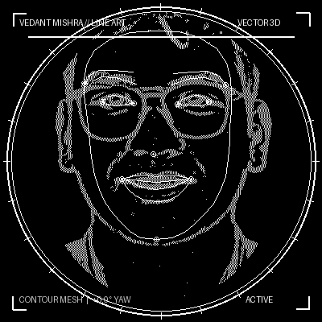
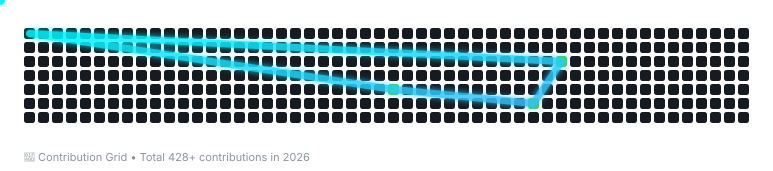

   

  

  
  
  
  

---

  <table>
    <tr>
      <td width="60%">
        <h2>👨‍💻 About Me</h2>
        
<b>Building Smart Systems, Not Just Code. ⚡</b>

        
Passionate Computer Science undergraduate focused on crafting intelligent AI platforms, computer vision applications, and high-performance full-stack web architectures.

        <ul>
          <li>🎓 <b>Education:</b> B.Tech in Computer Science Engineering @ Vellore Institute of Technology (2028)</li>
          <li>💻 <b>Leadership:</b> Technical Lead at BitByBit Club (Jan 2026 - Present)</li>
          <li>🤖 <b>Research & Deep Tech:</b> Molecular Orbital Theory + AI/ML & Autonomous Agents</li>
          <li>💼 <b>Open for Freelance & Collaborative Innovation</b></li>
        </ul>
      </td>
      <td width="40%" align="center">
        
      </td>
    </tr>
  </table>

---

<h2 align="center">⚡ Tech Arsenal & Skills</h2>

  

  <table>
    <tr>
      <td width="50%">
        <b>💻 Languages & Core</b> 
        • Python, C++, Java, JavaScript, SQL 
        • Data Structures & Algorithms, OOP, OS, Networks
      </td>
      <td width="50%">
        <b>🤖 AI, ML & Computer Vision</b> 
        • MediaPipe, OpenCV, Supervised Learning 
        • NumPy, Pandas, Matplotlib, Scikit-Learn
      </td>
    </tr>
    <tr>
      <td width="50%">
        <b>🌐 Web & Backend</b> 
        • Flask, REST APIs, React, HTML5, CSS3 
        • Custom Tkinter, Responsive UI/UX
      </td>
      <td width="50%">
        <b>🛠️ DevOps & Tools</b> 
        • Git, GitHub Actions, Linux, VS Code 
        • PyCharm, Cloud Hosting, Vercel
      </td>
    </tr>
  </table>

---

<h2 align="center">🔥 Featured Projects</h2>

| 🚀 Project | 🛠️ Tech Stack | 💡 Highlights | 🔗 Links |
| :--- | :--- | :--- | :--- |
| **Veyanix** | Flask, OCR, Machine Learning | Autonomous Intelligence Platform & Web OS for smart productivity and workflows | [Live Demo](https://v-os-ywqb.vercel.app/) • [GitHub Repo](https://github.com/vmishra06-cdk/Veyanix) |
| **GramSetu** | Python, AI, Bilingual NLP | AI-Powered Smart Village Platform digitizing governance, public schemes & grievance resolution | [GitHub Repo](https://github.com/vmishra06-cdk/GramSetu) |
| **Digital Legacy Vault** | Full Stack, Cryptography, Security | Secure digital inheritance: *"Decide today what happens to your digital life tomorrow"* | [GitHub Repo](https://github.com/vmishra06-cdk/Digital-Legacy-Vault) |
| **Face Detection & Air Writing** | Python, OpenCV, MediaPipe | Real-time face tracking & index-finger mid-air drawing without peripheral hardware | [GitHub Repo](https://github.com/vmishra06-cdk/Face-Detection-Air-Writing) |
| **SmartTrace AI** | Python, AI/ML Analytics | Intelligent real-world process tracking & analytics platform | [Live Demo](https://smart-trace-ai-ct4r.vercel.app/) • [GitHub Repo](https://github.com/vmishra06-cdk/SmartTrace) |
| **Digital Declutterer** | Python, Custom Tkinter | Automated digital workspace organizer and intelligent system cleanup utility | Desktop App |

---

<h2 align="center">🏆 3D GitHub Achievements</h2>

  

---

<h2 align="center">📈 GitHub Analytics</h2>

  
  

  

---

<h2 align="center">🐍 Contribution Snake</h2>

  <picture>
    <source media="(prefers-color-scheme: dark)" srcset="assets/github-contribution-grid-snake-dark.svg">
    <source media="(prefers-color-scheme: light)" srcset="assets/snake.svg">
    
  </picture>

---

  
<b>⚡ "Building Smart Systems, Not Just Code." ⚡</b>

  
  

